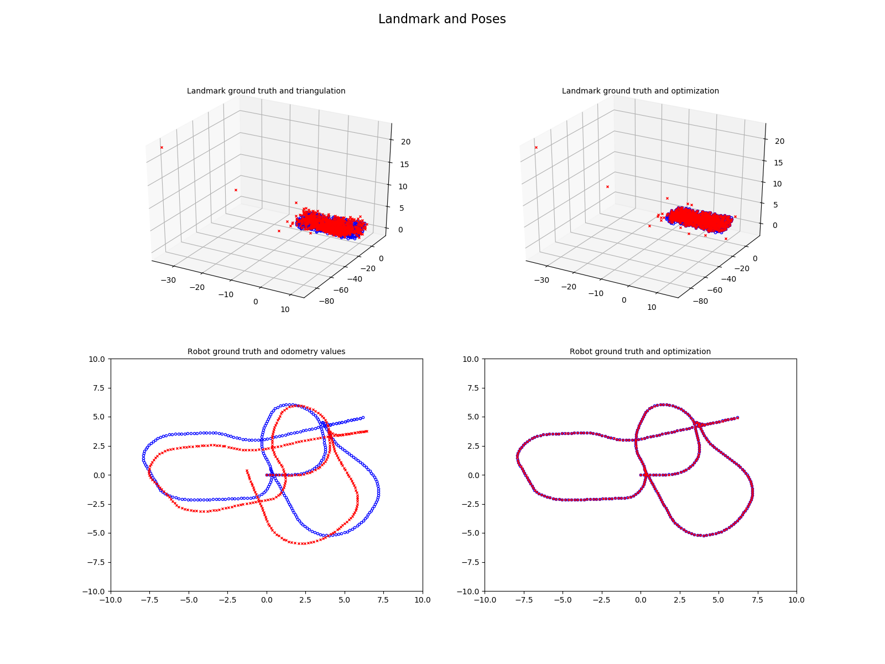
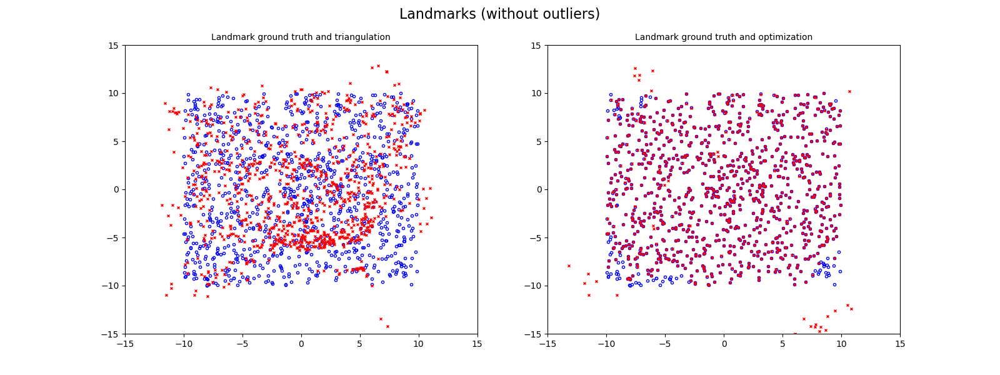

# Planar Monocular SLAM

The goal of this project is to develop a SLAM system using Total Least Square algorithm to determine the trajectory of a robot moving in a given environment. This robot perceives the environment only using a stereo camera mounted on its base and its motion by the odometry sensor.

Before the optimization, the information known is the odometry for the trajectory and the landmarks position estimated by triangulation (first column of figure below and the goal is to make the prediction match the ground truth values.

The program was written in Python and it succeeds in estimating the right trajectory of the robot and also most of the landmarks, with the exception of some that were bad initialized due to lack of information collected by the camera.

 
<i>Landmark and poses before and after optimization</i>

 
<i>Landmark before and after optimization</i>

## How to run

To run this project is necessary to create the environment using the file `environment.yml` and run the following command.

`python main.py`
